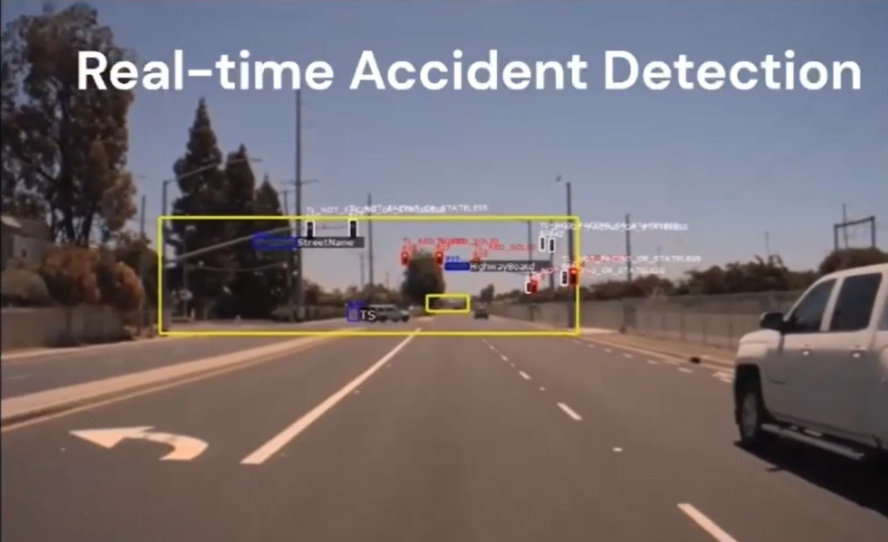

# Road Accident Prediction System

## About

The Road Accident Prediction System is a comprehensive solution designed to enhance road safety by leveraging machine learning (ML), deep learning (DL), computer vision (CV), and real-time data analysis techniques. The system aims to predict potential road accidents by analyzing video input from a camera module installed in vehicles. It detects various traffic signals, identifies potholes, performs real-time anomaly detection (such as unauthorized pedestrian crossings), and detects objects and obstacles in the vehicle's field of vision. Additionally, it analyzes the driver's behavior based on inputs like acceleration, brake, and throttle to assess potential risks.

## Video Demonstration

Click the image above to watch a demonstration of the Road Accident Prediction System.

## Technologies Used

- Machine Learning (ML)
- Deep Learning (DL)
- Computer Vision (CV)
- Python
- OpenCV
- TensorFlow
- Keras
- PyTorch
- Data Analysis Libraries (e.g., NumPy, Pandas)
- Scikit-learn (for ML algorithms)
- Real-time Data Processing Techniques

## Features

1. **Video Input Processing:** Utilizes camera module input to analyze road conditions and surrounding environments.
2. **Traffic Signal Classification:** Identifies and classifies 43 different traffic signals for better road awareness.
3. **Pothole Detection:** Detects potholes on the road surface to alert drivers and prevent potential damage to vehicles.
4. **Real-time Anomaly Detection:** Identifies anomalies such as unauthorized pedestrian crossings or vehicles violating traffic rules.
5. **Object and Obstacle Detection:** Detects objects and obstacles in the vehicle's field of vision to assist drivers in avoiding collisions.
6. **Driver Behavior Analysis:** Analyzes driver inputs (acceleration, brake, throttle) to assess driving behavior and potential risks.

## Usage

1. Install the necessary libraries and dependencies listed in the `requirements.txt` file.
2. Connect the camera module to the system (e.g., Raspberry Pi) and ensure it has a clear view of the road.
3. Run the main script to start the road accident prediction system.
4. Monitor the system's output, including traffic signal classifications, pothole detections, anomaly alerts, and driver behavior analysis.
